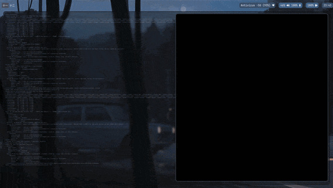

# bad-apple-ascii-python

A terminal-based ASCII rendition of the iconic **Bad Apple!!** music video, built entirely in Python. The project converts each video frame into ASCII characters and renders it directly in the terminal, recreating the animation using only text.

This project was created to experiment with ASCII rendering, video processing, and terminal graphics in Python.

## Features

* Plays the **Bad Apple!!** music video in the terminal
* Real-time ASCII frame rendering
* Lightweight Python implementation
* Configurable ASCII character set
* Cross-platform terminal support

## Preview



## Installation

Clone the repository:

```bash id="p7n2kv"
git clone https://github.com/yourusername/bad-apple-ascii-python.git
cd bad-apple-ascii-python
```

Install the required dependencies:

```bash id="8yx3az"
pip install -r requirements.txt
```

Run the project:

```bash id="4gf91e"
python main.py
```

## Built With

* Python
* BeautifulSoup
* Terminal ASCII rendering

## Project Structure

```text id="n1d8qu"
bad-apple-ascii-python/
├── frames/
├── main.py
├── requirements.txt
└── README.md
```

## How It Works

Each frame of the source video is converted into grayscale and mapped to a set of ASCII characters based on pixel brightness. The resulting text frames are then rendered sequentially in the terminal, creating the illusion of motion using only characters.

## Roadmap

* Audio synchronization
* Adjustable playback speed
* Custom ASCII character sets
* Colorized terminal output
* Performance optimizations
* Support for additional videos

## Contributing

Contributions, bug reports, and suggestions are welcome. Feel free to open an issue or submit a pull request.

## License

This project is currently unlicensed. A license will be added before a public release.
